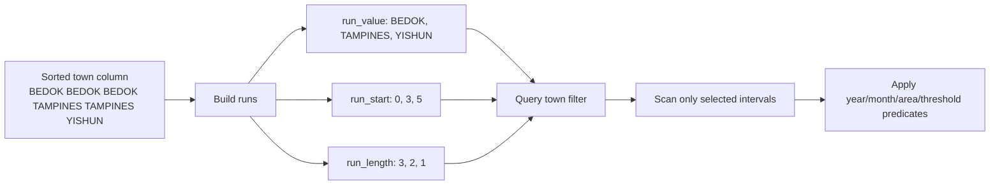

# A5 RLE Town Layout

```mermaid
flowchart LR
	A[Sorted town column<br/>BEDOK BEDOK BEDOK TAMPINES TAMPINES YISHUN] --> B[Build runs]
	B --> C[run_value: BEDOK, TAMPINES, YISHUN]
	B --> D[run_start: 0, 3, 5]
	B --> E[run_length: 3, 2, 1]
	C --> F[Query town filter]
	D --> F
	E --> F
	F --> G[Scan only selected intervals]
	G --> H[Apply year/month/area/threshold predicates]
```

